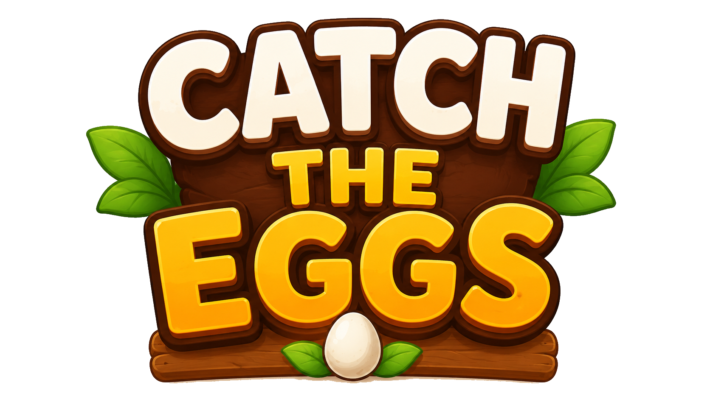

# Catch The Eggs



**Catch The Eggs** is a fast, colorful Godot arcade game for Android and desktop. Birds drop eggs from the trees, the player runs with a basket to catch them, and the round gets harder as falling items speed up. Catch eggs to raise your score, avoid poop, dodge ground bugs, and protect your best score.

## Latest Android APK

| Item | Details |
| --- | --- |
| Latest APK version | `v1.0.0` |
| Version code | `1` |
| Last updated | `2026-06-10` |
| Android package | `com.kazolhabib.catchtheeggs` |
| Download | [catch-the-eggs-v1.0.0.apk](releases/catch-the-eggs-v1.0.0.apk) |

Download the APK on an Android phone, allow installation from your browser or file manager if prompted, then install and play.

## Gameplay

- Catch normal eggs to gain points.
- Catch golden eggs for bonus score.
- Avoid normal poop, because it reduces your score.
- Avoid golden poop, because it ends the game instantly.
- Jump over crawling bugs and keep the basket moving.
- Try to beat your saved high score before the run falls apart.

## Recent Update Highlights

- Android-focused responsive layout for phone and tablet screens.
- Bigger mobile touch controls with fallback touch zones.
- New app icon, splash screen, and loading screen.
- Polished sound effects for egg cracks, poop splats, jumping, birds, buttons, and bugs.
- Randomized bug colors, sizes, movement feel, and looping crawl sound.
- Golden poop glow and improved item feedback.
- Play Store export preset included for Android builds.

## Built With

- Godot `4.6`
- GDScript
- Android export support
- Custom 2D sprites, UI assets, fonts, and sound effects

## Run From Source

1. Install Godot `4.6` or newer.
2. Clone this repository.
3. Open the project folder in Godot.
4. Open `Scenes/main.tscn`.
5. Press Play.

## Android Export

The project includes an Android Play Store export preset in `export_presets.cfg`.

- Export format: Android App Bundle (`.aab`)
- Version name: `1.0.0`
- Version code: `1`
- Architecture: `arm64-v8a`
- Package name: `com.kazolhabib.catchtheeggs`

For direct testing, use the APK linked above. For store publishing, export a signed `.aab` from Godot.

## Project Structure

```text
Assets/      Game art, UI, fonts, and audio
Scenes/      Godot scenes for player, birds, eggs, poop, bugs, and main game
Scripts/     Gameplay, layout, audio, spawning, and player control logic
releases/    Downloadable Android APK builds
```

## Screenshots

Screenshots will be added with the next visual release pass.

